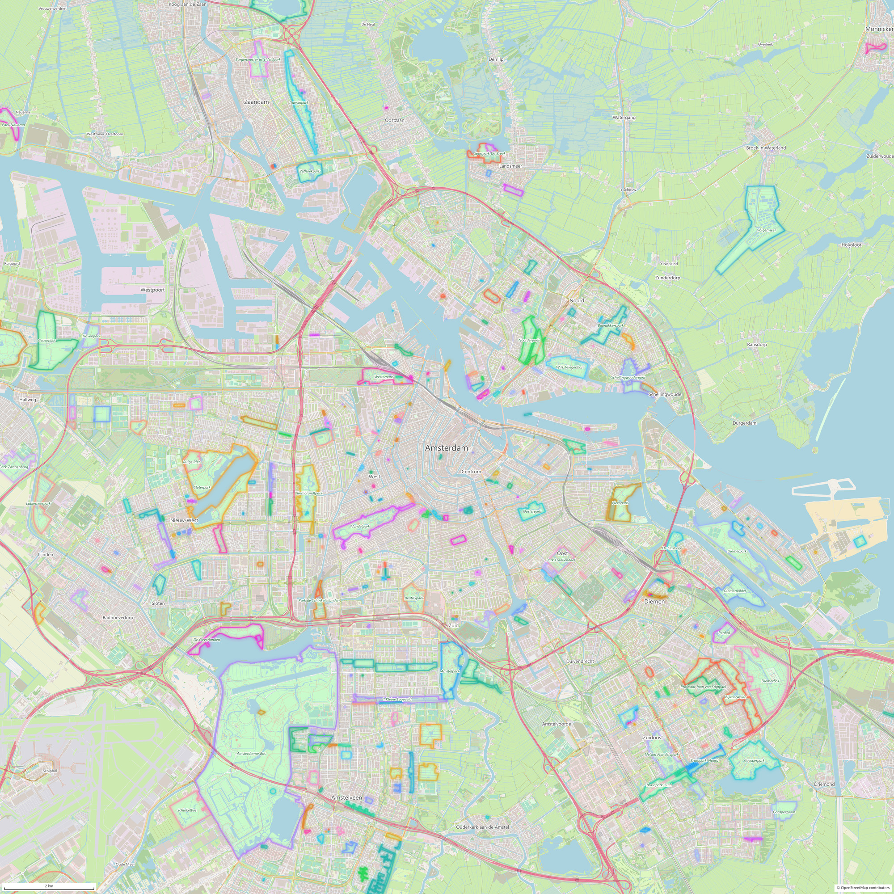
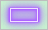
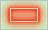
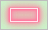
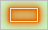
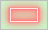
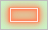

# Public park energy signature — Amsterdam

Base map of Amsterdam, ±10 km around Dam Square, rendered from OpenStreetMap data. Every public park is outlined in glowing neon, each park in its own colour.

<table>
<tr>
<td valign="top">

[](https://nielswritescode.github.io/public-park-energy-signature-amsterdam/assets/amsterdam-map.jpg)

<sub>Click the map for the full-resolution image (8000 × 8000 px, 2.5 m per pixel, 26 MB) or [download it](https://github.com/nielswritescode/public-park-energy-signature-amsterdam/raw/main/assets/amsterdam-map.jpg).</sub>

</td>
<td valign="top" width="250">

<!-- legend:start -->

### Legend

| Outline | Park |
|:-:|:--|
|  | Amsterdamse Bos |
|  | Sloterpark |
|  | Volgermeer |
|  | Diemerbos |
|  | Geuzenbos |
|  | Diemerpark |
|  | Bijlmerweide |
|  | Gaasperpark |
|  | Vondelpark |
|  | Rembrandtpark |
|  | Amstelpark |
|  | Schinkelbos |
|  | Jagersveld |
|  | Nelson Mandelapark |
|  | Recreatiegebied Houtrak |
|  | Darwinpark |
|  | De Oeverlanden |
|  | Noorderpark |
|  | Diemerpolder |
|  | Lutkemeerpark |
|  | Gijsbrecht van Aemstelpark |
|  | Park Zwanenburg |
|  | Flevopark |
|  | W.H. Vliegenbos |
|  | Westerpark |
|  | Brasapark-Zuid |
|  | Schellingwouderpark |
|  | Beatrixpark |
|  | Baanakkerspark |
|  | Burgemeester in 't Veldpark |

*Smaller parks reuse these colours.*

<!-- legend:end -->

</td>
</tr>
</table>

## About the map

- **Area:** 20 × 20 km centred on Dam Square (52.3731° N, 4.8926° E), i.e. ±10 km.
- **Public parks:** OSM `leisure=park`, `leisure=common` and `landuse=village_green`, excluding anything tagged `access=private|no|customers|permit|members`. 380 are mapped inside the map area (about 7% of it). The 348 of at least 200 m² are outlined; the 32 smaller ones are skipped. Each outline has its own neon colour from a palette of 30, and neighbouring parks always get different colours.
- **Rendering:** the map is drawn from raw OSM data with a small Python renderer, in an OpenStreetMap-Carto-like palette. It is drawn as a 4 × 4 grid of tiles that are concatenated into one image. No map tiles are downloaded from OSM's tile servers.

## Edit the legend

The legend next to the map lives in [`legend.md`](legend.md): one row per park, with its outline colour and its name. It lists the 30 largest named parks; smaller parks reuse those colours. Edit it as plain markdown, then run:

```
python scripts/build_readme.py
```

This copies `legend.md` into the block between the `legend:start` / `legend:end` markers above. Swatch images are in [`assets/legend/parks/`](assets/legend/parks/). Re-rendering the map never overwrites your `legend.md`; `python scripts/render.py --reset-legend` regenerates it (`--legend-parks N` sets how many parks it lists).

## Rebuild

```
python -m venv .venv
.venv/Scripts/pip install -r requirements.txt     # Windows; use .venv/bin on Linux/macOS
curl -L -o data/raw/Amsterdam.osm.pbf https://download.bbbike.org/osm/bbbike/Amsterdam/Amsterdam.osm.pbf
python scripts/extract.py                         # classify OSM features, cache them
python scripts/render.py                          # render assets/amsterdam-map.jpg
python scripts/build_readme.py                    # refresh the legend on this page
```

Colours, line widths and the neon glow are all in [`scripts/style.py`](scripts/style.py). `python scripts/render.py --res 10 --grid 1` gives a quick draft.

## Data

Map data © [OpenStreetMap contributors](https://www.openstreetmap.org/copyright), available under the [Open Database Licence](https://opendatacommons.org/licenses/odbl/). Extract: [BBBike Amsterdam](https://download.bbbike.org/osm/bbbike/Amsterdam/), built 19 Sep 2026.
