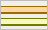
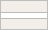
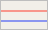

<!-- Edit this file freely: it is the legend shown next to the map on the main page.
     After editing, run  python scripts/build_readme.py  to refresh README.md.
     Swatches live in assets/legend/ - drop in your own PNGs and point at them below. -->

### Legend

| | |
|:-:|:--|
|  | **Public park** neon glowing outline |
|  | Grass, gardens, woods |
|  | Water |
|  | Buildings |
|  | Motorway / trunk road |
|  | Primary / secondary road |
|  | Local street |
|  | Footpath / cycle path |
|  | Railway |
|  | Residential area |
|  | Industrial / commercial |
|  | Sports & recreation |
|  | Farmland / allotments |
